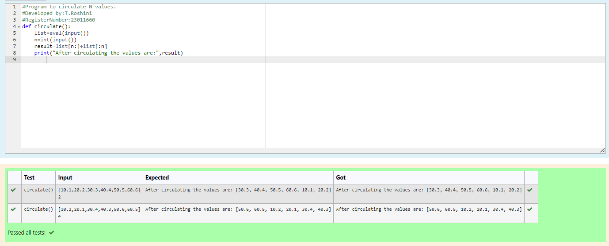

# Circulate-the-values-of-N-variables
## Aim:
To write a python program to circulate the n variables using function concept
## Equipment’s required:
PC
Anaconda - Python 3.7
## Algorithm: 
### Step 1: 
Start the Program
### Step 2: 
Write the code appropriately
### Step 3: 
Get the value from the user for the number of rotation
### Step 4: 
Using the slicing concept rotate the list

### Step 5: 
Check the code
### Step 6: 
Run the program
## Program:
```
#Program to circulate N values.
#Developed by:T.Roshini 
#RegisterNumber:23011660
def circulate():
    list=eval(input())
    n=int(input())
    result=list[n:]+list[:n]
    print("After circulating the values are:",result)
        
```
## Output:

## Result:
Thus the progam executed successfully
